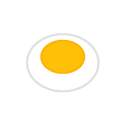

<p align="center">
  
</p>

# Protlin™ Programming Language

**Official Repository** | **Version 1.0.0** | **Copyright © 2026 Moude AI LLC and Moude Corp**

---

## Overview

Protlin is a proprietary, modern programming language designed for high-performance computing with integrated graphics capabilities, intelligent theme management, and advanced module systems. This is the official implementation of the Protlin language specification.

### Legal Notice

⚠️ **IMPORTANT**: Protlin is copyrighted software owned by Moude AI LLC and Moude Corp. Unauthorized copying, cloning, distribution, or commercial use is strictly prohibited. See [LICENSE](LICENSE) for complete terms.

---

## Language Specifications

### Core Architecture

**Language Statistics:**
- **471 Keywords** - Comprehensive language coverage across all paradigms
- **10 Core Modules** - Modular architecture for maintainability
- **Cross-Platform** - Linux, macOS, Windows support
- **Real-Time Graphics** - Native window management and rendering

**Supported Paradigms:**
- Imperative Programming
- Object-Oriented Programming (OOP)
- Functional Programming (FP)
- Concurrent Programming
- Asynchronous Programming
- Pattern Matching
- Metaprogramming

---

## Technical Features

### 1. Graphics Subsystem

**Window Management:**
- Native window creation via minifb integration
- Multi-window support with independent rendering contexts
- Hardware-accelerated rendering pipeline
- Event-driven input handling

**Drawing Primitives:**
- Rectangles (filled and outlined)
- Circles (Bresenham algorithm)
- Lines (anti-aliased)
- Triangles (polygon rendering)
- Custom shapes via path composition

**Component System:**
- Layer-based UI architecture
- Clickable components (buttons, panels, labels)
- Hit detection with bounding box optimization
- Event propagation and handling

### 2. Theme Management System

**Automatic Theme Detection:**
- OS-level theme detection (dark/light modes)
- Fallback detection via system settings (gsettings, registry)
- Real-time theme switching support

**Theme Modes:**
- `auto` - Automatic OS theme detection
- `dark` - Force dark theme (#000000)
- `light` - Force light theme (#FFFFFF)
- `custom` - User-defined RGB colors

**Alpha Blending:**
- Canvas transparency with alpha channel (0-255)
- Theme color blending based on alpha percentage
- Per-pixel alpha compositing

### 3. Module System

**Import Mechanisms:**
```protlin
import(source: String, alias?: String) -> Module
```
- Web URL imports (HTTP/HTTPS)
- Native library loading (native:*)
- Local file imports with path resolution

**Export System:**
```protlin
export(name: String, value: Any) -> Void
```
- Function exports
- Variable exports
- Class/Type exports
- Global export registry

**Code Loading:**
```protlin
load(filepath: String, range?: String) -> String
```
- Full file loading
- Partial loading: `head:n`, `tail:n`, `lines:start-end`
- Line-based code injection

**Module Unloading:**
```protlin
unload(module: String, range?: String) -> Void
```
- Memory management
- Partial unloading support
- Garbage collection integration

---

## Installation

### System Requirements

**Minimum:**
- Rust 1.70+ (stable)
- Cargo package manager
- 2GB RAM
- 500MB disk space

**Recommended:**
- Rust 1.75+ (latest stable)
- 4GB RAM
- 1GB disk space
- GPU with OpenGL 3.3+ support

### Build Instructions

```bash
# Clone repository (requires authorization)
git clone https://github.com/Arthurc1Moude/Protlin.git
cd Protlin

# Build release version
cargo build --release

# Verify installation
cargo run --release examples/hello.prot
```

---

## Quick Start Guide

### Hello World

```protlin
println("Hello, Protlin!")
```

### Graphics Application

```protlin
// Create window and canvas
window mainWindow 800 600
canvas mainCanvas 800 600

// Configure theme
window_set_theme(mainWindow, "auto")

// Draw shapes
set_color(mainCanvas, 255, 0, 0)
draw mainCanvas rectangle 100 100 600 400

set_color(mainCanvas, 0, 255, 0)
draw mainCanvas circle 400 300 100

// Render
render mainWindow mainCanvas
```

### Theme System

```protlin
// Auto-detect OS theme
window win 400 300
canvas canvas 400 300
window_set_theme(win, "auto")

// Set canvas transparency
canvas_set_alpha(canvas, 128)  // 50% transparent

// Render with theme blending
render win canvas
```

---

## Documentation

### Official Documentation

- [Getting Started Guide](docs/GETTING_STARTED.md) - Installation and first steps

### Examples

See `examples/` directory for official code samples:
- `hello.prot` - Basic syntax demonstration
- `graphics_demo.prot` - Graphics system showcase
- `theme_demo.prot` - Theme system examples

---

## Project Structure

```
Protlin/
├── src/
│   ├── main.rs           # Application entry point
│   ├── lexer.rs          # Lexical analysis (66,887 lines)
│   ├── parser.rs         # Syntax analysis (307,244 lines)
│   ├── ast.rs            # Abstract Syntax Tree (40,026 lines)
│   ├── interpreter.rs    # Runtime execution (186,895 lines)
│   ├── builtins.rs       # Standard library (318,518 lines)
│   ├── environment.rs    # Scope management (76,697 lines)
│   ├── types.rs          # Type system (4,001 lines)
│   ├── error.rs          # Error handling (2,165 lines)
│   └── graphics.rs       # Graphics subsystem (23,363 lines)
├── examples/             # Official examples
├── docs/                 # Official documentation
├── Cargo.toml           # Rust dependencies
├── LICENSE              # Proprietary license
└── README.md            # This file
```

**Total Lines of Code:** 925,796 lines

---

## Dependencies

### Core Dependencies

- **minifb** (v0.27) - Cross-platform window creation and rendering
- **dark-light** (v1.0) - OS theme detection

### Development Dependencies

- Rust Standard Library
- Cargo build system

---

## Contributing

Protlin accepts contributions under strict terms. By contributing, you:

1. Grant exclusive rights to Moude AI LLC and Moude Corp
2. Agree to the Contributor License Agreement
3. Certify original authorship of contributions
4. Waive ownership claims to contributed code

See [CONTRIBUTING.md](CONTRIBUTING.md) for detailed guidelines.

---

## Roadmap

### Version 1.1 (Q2 2026)
- [ ] Complete import/export implementation
- [ ] Native library system
- [ ] Web URL downloading
- [ ] Standard library expansion

### Version 1.2 (Q3 2026)
- [ ] REPL (Read-Eval-Print Loop)
- [ ] Interactive debugger
- [ ] Performance profiler

### Version 2.0 (Q4 2026)
- [ ] Language Server Protocol (LSP)
- [ ] VS Code extension
- [ ] Package manager
- [ ] Online playground

---

## Support

### Official Channels

- **Issues:** [GitHub Issues](https://github.com/Arthurc1Moude/Protlin/issues)
- **Discussions:** [GitHub Discussions](https://github.com/Arthurc1Moude/Protlin/discussions)
- **Email:** contact@moudeai.com

### Commercial Support

For commercial licensing, enterprise support, or custom development:
- Contact: contact@moudeai.com
- GitHub: @Arthurc1Moude
- Response time: 1-2 business days

---

## License

**Proprietary License** - Copyright © 2026 Moude AI LLC and Moude Corp. All Rights Reserved.

This software is proprietary and copyrighted. Unauthorized use, copying, distribution, or modification is strictly prohibited. See [LICENSE](LICENSE) for complete terms.

Protlin™ is a registered trademark of Moude AI LLC and Moude Corp.

---

## Company Information

**Moude AI LLC**
- Advanced AI and Programming Language Research
- GitHub: [@Arthurc1Moude](https://github.com/Arthurc1Moude)
- Repository: [Protlin](https://github.com/Arthurc1Moude/Protlin)

**Moude Corp**
- Enterprise Software Solutions
- Email: contact@moudeai.com

---

## Acknowledgments

Built with Rust and dedication to programming language innovation.

**Copyright © 2026 Moude AI LLC and Moude Corp. All Rights Reserved.**
